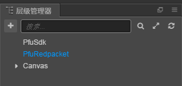
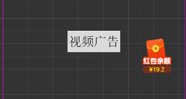

# PfuRedpacket

### 导入资源
将`redpacket`文件夹拖入场景中，把`redpacket/prefabs/PfuRedpacket.prefab`拖放到场景根节点，如下图所示:




### 每日登陆红包
将`redpacket/prefabs/btnRedpacket`拖放到任意UI节点下，此控件可以存在多个，根据游戏需求在需要的界面放置即可，效果如下图：



点击此按钮后会显示七天登陆领红包界面，如果今天已经领取会显示余额界面。

### 随机掉落红包
可以用代码主动呼出红包界面

>showRedpacket

| 参数 | 含义 |
| :------| :------ |
|type| Watch:看视频领红包  Share:分享领红包|
|des| 自定义描述（暂时不用）|

```
const Redpacket = require("PfuRedpacket");
Redpacket.Instance.showRedpacket({
            type:"Watch"
        });
```